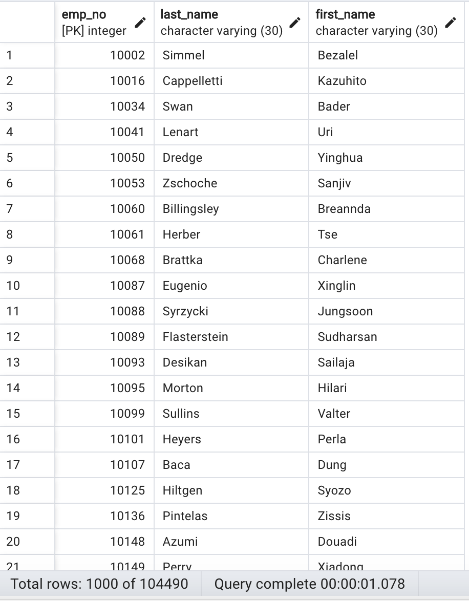

EMPLOYEESQL:
For this challenge, I took references from the class activities. Below are some of the outputs from the queries:

1.List the employee number, last name, first name, sex, and salary of each employee.

2.List the first name, last name, and hire date for the employees who were hired in 1986.

3.List the manager of each department along with their department number, department name, employee number, last name, and first name.

4.List the department number for each employee along with that 
--employee’s employee number, last name, first name, and department name.

5.List first name, last name, and sex of each employee whose first name is Hercules and whose last name begins with the letter B.

6.List each employee in the Sales department, including their employee number, last name, and first name.

7.List each employee in the Sales and Development departments, including their employee number, last name, first name, and department name.

8.List the frequency counts, in descending order, of all the employee last names (that is, how many employees share each last name).
